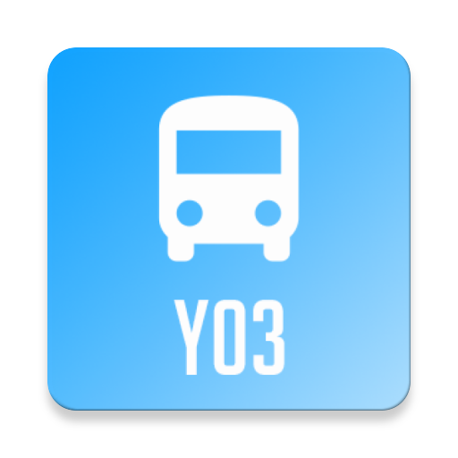

# Yongsan03Alrimi
<!--
*** Thanks for checking out the Best-README-Template. If you have a suggestion
*** that would make this better, please fork the repo and create a pull request
*** or simply open an issue with the tag "enhancement".
*** Thanks again! Now go create something AMAZING! :D
-->

<!-- PROJECT SHIELDS -->
<!--
*** I'm using markdown "reference style" links for readability.
*** Reference links are enclosed in brackets [ ] instead of parentheses ( ).
*** See the bottom of this document for the declaration of the reference variables
*** for contributors-url, forks-url, etc. This is an optional, concise syntax you may use.
*** https://www.markdownguide.org/basic-syntax/#reference-style-links
-->
<!-- [![Contributors][contributors-shield]][contributors-url]
[![Forks][forks-shield]][forks-url]
[![Stargazers][stars-shield]][stars-url]
[![Issues][issues-shield]][issues-url] -->

<!-- PROJECT LOGO -->
 

  

  <h3 align="center">Yongsan 03 Alrimi</h3>

  

    Yongsan 03 town bus information for all Digitech highschool students & teachers!
     
     
    <a href="https://github.com/sukjong2002/Yongsan03Alrimi">View Demo</a>
    ·
    <a href="https://github.com/sukjong2002/Yongsan03Alrimi/issues">Report Bug</a>
    ·
    <a href="https://github.com/sukjong2002/Yongsan03Alrimi/issues">Request Feature</a>
     
     
  
  

<!-- TABLE OF CONTENTS -->

  
Table of Contents

  <ol>
    <li>
      <a href="#about-the-project">About The Project</a>
      <ul>
        <li><a href="#built-with">Built With</a></li>
      </ul>
    </li>
    <li><a href="#contributing">Contributing</a></li>
    <li><a href="#contact">Contact</a></li>
  </ol>

<!-- ABOUT THE PROJECT -->
## About The Project

This project started from 2019 in Digitech High School in Yongsan, Seoul.
This application will be useful for Dightech HighScool Student as well as teachers.

This project is started from private android development project for study, but if you want to contribute function, design etc, feel free to send pull request! I am happy to impliment your contribution!

이 프로젝트는 2019년 디지텍고등학교에서 만들었습니다.
디지텍고등학교 학생과 선생님들에게 유용한 애플리케이션입니다.

개인 안드로이드 개발 공부용으로 만들어진 프로젝트지만 이 프로젝트에 추가할 기능, 디자인 변경점이 있으시다면 언제든 Pull Request를 전송해 주세요. 빠르게 검토 후 적용하겠습니다.

### Built With

This Android Project is built with:
* [Android](https://android.com)
* [Android Studio](https://developer.android.com/studio)
* [Java](https://java.com)

<!-- CONTRIBUTING -->
## Contributing

Contributions are what make the open source community such an amazing place to be learn, inspire, and create. Any contributions you make are **greatly appreciated**.

1. Fork the Project
2. Create your Feature Branch (`git checkout -b feature/AmazingFeature`)
3. Commit your Changes (`git commit -m 'Add some AmazingFeature'`)
4. Push to the Branch (`git push origin feature/AmazingFeature`)
5. Open a Pull Request

<!-- CONTACT -->
## Contact

seokjong@smaroid.tk

[https://github.com/sukjong2002/Yongsan03Alrimi](https://github.com/sukjong2002/Yongsan03Alrimi)

<!-- MARKDOWN LINKS & IMAGES -->
<!-- https://www.markdownguide.org/basic-syntax/#reference-style-links -->
[contributors-shield]: https://img.shields.io/github/contributors/othneildrew/Best-README-Template.svg?style=for-the-badge
[contributors-url]: https://github.com/sukjong2002/Yongsan03Alrimi/graphs/contributors
[forks-shield]: https://img.shields.io/github/forks/othneildrew/Best-README-Template.svg?style=for-the-badge
[forks-url]: https://github.com/sukjong2002/Yongsan03Alrimi/network/members
[stars-shield]: https://img.shields.io/github/stars/othneildrew/Best-README-Template.svg?style=for-the-badge
[stars-url]: https://github.com/sukjong2002/Yongsan03Alrimi/stargazers
[issues-shield]: https://img.shields.io/github/issues/othneildrew/Best-README-Template.svg?style=for-the-badge
[issues-url]: https://github.com/sukjong2002/Yongsan03Alrimi/issues
[license-shield]: https://img.shields.io/github/license/othneildrew/Best-README-Template.svg?style=for-the-badge
[linkedin-shield]: https://img.shields.io/badge/-LinkedIn-black.svg?style=for-the-badge&logo=linkedin&colorB=555
[product-screenshot]: images/screenshot.png
[onestore-shield]: images/store_badge.png
[onestore-link]: https://m.onestore.co.kr/mobilepoc/apps/appsDetail.omp?prodId=0000743900
